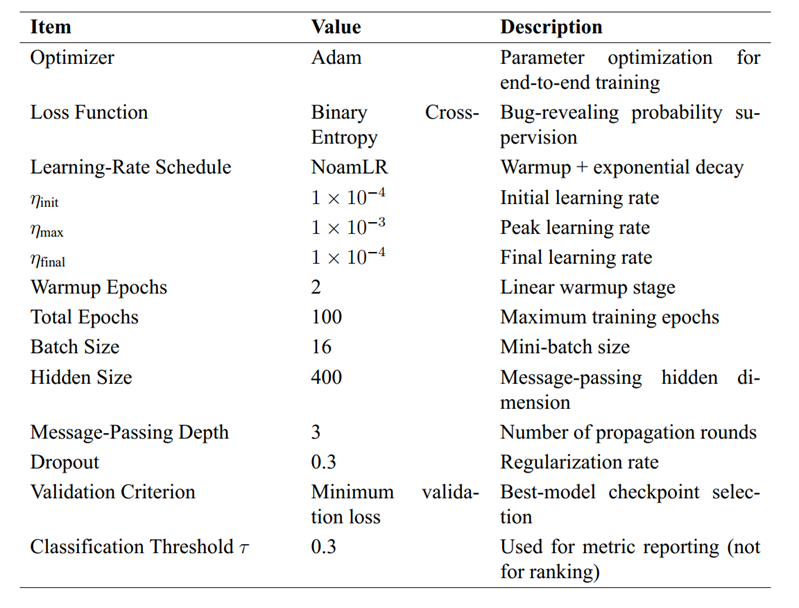

## MeDAC

<a href="./LICENSE"></a> 

This repository provides the tool (i.e., MeDAC) and all experimental data for our work: "Accelerating Deep Learning Compiler Testing via
Message Passing Neural Network with Attention", which has been submitted to IEEE Transactions on Reliability. 

### File Structure
This repository is organized by experimental scenario. Each scenario is an independent pipeline that includes model generation, execution, dataset construction, and prioritization evaluation.

```text
MeDAC-main/
├─ README.md
├─ Hardware.md
├─ requirements.txt
├─ REPRODUCTION_GUIDE.md
├─ docs/
├─ nnsmith_ort_v1.16.0/nnsmith/
├─ nnsmith_ort_v1.17.0/nnsmith/
├─ nnsmith_tvm_v0.10.0/nnsmith/
└─ nnsmith_tvm_v0.11.1/nnsmith/
```

Each scenario folder follows the same role-based layout:

- `generate_model.sh`, `exec_model.sh`: random test-model generation and backend execution.
- `error.py`, `error_classify.py`, `error_classify_op.py`: bug-case extraction and error-type filtering.
- `merge_info_train.py`, `merge_info.py`, `merge_info_only.py`: training/test JSON construction with graph/time metadata.
- `MPNN_edge_message_TCP.ipynb`: MeDAC (MPNN + attention) training and ranking-based speedup evaluation.
- `LET.ipynb`, `gcn_new.ipynb`: LET and GCN baselines for comparison.
- `*.pth`: saved model checkpoints.
- `*-testdata_*`, `*.pkl`: prepared evaluation sets and speedup/statistical artifacts.
- `nnsmith/`, `experiments/`, `tests/`: integrated upstream NNSmith codebase and utilities.

This structure allows all four scenarios to be reproduced with the same workflow while preserving backend/version-specific settings.

## Quick Navigation

- Hardware and base environment: `Hardware.md`
- Python dependencies: `requirements.txt`
- Parameter details: see `Parameter Reference` section in this `README.md`
- Full end-to-end reproduction: `REPRODUCTION_GUIDE.md`

## Repository Layout

This repository contains four scenario folders (two ORT versions and two TVM versions):

- `nnsmith_ort_v1.16.0/nnsmith`
- `nnsmith_ort_v1.17.0/nnsmith`
- `nnsmith_tvm_v0.10.0/nnsmith`
- `nnsmith_tvm_v0.11.1/nnsmith`

Each scenario folder includes:

- data generation scripts (`generate_model.sh`)
- execution scripts (`exec_model.sh`)
- data processing scripts (`error.py`, `error_classify.py`, `merge_info*.py`)
- model notebooks (`MPNN_edge_message_TCP.ipynb`, `LET.ipynb`, `gcn_new.ipynb`)
- checkpoints and precomputed artifacts (`*.pth`, `*.pkl`)

## Run MeDAC (Our Method)

This section only keeps the minimal steps to run MeDAC itself (`MPNN_edge_message_TCP.ipynb`).

### 1. Environment

From repository root:

```bash
cd MeDAC-main
python -m venv .venv
source .venv/bin/activate
pip install --upgrade pip
pip install -r requirements.txt
```

### 2. Choose One Scenario

Use one of the following folders:

- `nnsmith_ort_v1.16.0/nnsmith`
- `nnsmith_ort_v1.17.0/nnsmith`
- `nnsmith_tvm_v0.10.0/nnsmith`
- `nnsmith_tvm_v0.11.1/nnsmith`

Example:

```bash
cd nnsmith_ort_v1.17.0/nnsmith
```

### 3. Open and Run MeDAC Notebook

Open:

- `MPNN_edge_message_TCP.ipynb`

Run the notebook cells in order:

1. load prepared dataset (`train_*.json` and `*-testdata_*/demo_test_data_info_0.json`)
2. build/train MeDAC model (or load existing `*.pth` checkpoint)
3. generate ranking scores for test cases
4. compute cumulative bug-detection time and speedup vs random order
5. export or save resulting `*.pkl` and figures

### 4. Expected Outputs

- trained checkpoint files (for example `best_model_0.pth`, `ablation_best_model.pth`)
- method traces (`mpnn-*.pkl`)
- speedup summary files (`*-speedup.pkl`)

For full pipeline reproduction (model generation, execution, all baselines, and cross-scenario aggregation), see `REPRODUCTION_GUIDE.md`.

## Methods and Evaluation

- Main method: MeDAC (MPNN with attention-based message passing)
- Baselines: LET and GCN
- Core metric: bug-finding efficiency (time-to-detect-bugs and speedup over random order)

## Parameter Reference

This section summarizes key experimental parameters used across scripts and notebooks.

### 0. Hyperparameter Figure



#### 0.1 Parameter Explanations (From the Figure)

- `Optimizer = Adam`: First-order optimizer used for end-to-end training. It is robust for sparse/noisy gradients in graph models.
- `Loss Function = Binary Cross-Entropy`: Supervises bug-revealing probability for binary classification (`bug` vs `non-bug`).
- `Learning-Rate Schedule = NoamLR`: Two-stage schedule. Warmup phase increases LR linearly; decay phase decreases LR exponentially.
- `eta_init = 1e-4`: Initial LR at the start of training; keeps updates stable before warmup ramps up.
- `eta_max = 1e-3`: Peak LR reached after warmup; controls maximal exploration capacity.
- `eta_final = 1e-4`: Final LR near training end; helps convergence stability.
- `Warmup Epochs = 2`: Number of epochs used for linear LR warmup.
- `Total Epochs = 100`: Maximum training epochs.
- `Batch Size = 16`: Mini-batch size used in optimization.
- `Hidden Size = 400`: Message-passing hidden feature dimension; larger values increase representation capacity and compute cost.
- `Message-Passing Depth = 3`: Number of propagation rounds on graph structure.
- `Dropout = 0.3`: Regularization ratio to reduce overfitting.
- `Validation Criterion = Minimum validation loss`: Selects best checkpoint by the lowest validation loss.
- `Classification Threshold tau = 0.3`: Threshold for reporting classification metrics. This threshold is for metric calculation, not for ranking-based speedup logic.

#### 0.2 Reproduction Note

- The figure above is the paper-style parameter configuration.
- Some scenario notebooks in this repository may show local defaults that differ from the paper configuration (for example hidden size or metric threshold).
- For strict paper-level reproduction, prioritize the figure configuration in this section.

### 1. Data Generation Parameters

Source scripts:

- `nnsmith_ort_v1.16.0/nnsmith/generate_model.sh`
- `nnsmith_ort_v1.17.0/nnsmith/generate_model.sh`
- `nnsmith_tvm_v0.10.0/nnsmith/generate_model.sh`
- `nnsmith_tvm_v0.11.1/nnsmith/generate_model.sh`

Common parameters:

- `model.type=onnx`
- `debug.viz=true`
- `mgen.max_nodes=$MAX_NODES`, where `MAX_NODES` is sampled in `[1, 30]`

Backend per scenario:

- ORT scenarios: `backend.type=onnxruntime`
- TVM scenarios: `backend.type=tvm`

Loop count in scripts:

- ORT scripts: `0..249999`
- TVM scripts: `0..299999`

### 2. Model Execution Parameters

Source scripts:

- `*/nnsmith/exec_model.sh`

Common execution command pattern:

```bash
nnsmith.model_exec model.type=onnx backend.type=<onnxruntime|tvm> model.path=nnsmith_output/model.onnx
```

Recorded time fields in downstream JSONs:

- generation side: `tgen`, `tmat`, `tfetch`, `tsave`
- execution side: `texec` (from `exec_time.json`)

### 3. Error Processing Rules

Source scripts:

- `error.py`
- `error_classify.py`
- `error_classify_op.py`

Rule summary:

- `error.py`: move folders containing `bug_report/`
- `error_classify.py`: classify non-accuracy errors by checking `err.log` does not contain `Not equal to tolerance`
- `error_classify_op.py`: classify operator-related errors by checking `err.log` contains one of:
	- `Unsupported operator`
	- `unknown intrinsic Op`
	- `NOT_IMPLEMENTED`

### 4. Training/Test Data Sampling Parameters

#### 4.1 Training set construction (`merge_info_train.py`)

`nnsmith_ort_v1.16.0/nnsmith/merge_info_train.py`:

- normal: 1000
- error accuracy: 0
- error other: 1000
- output: `train_1000_1000.json`, `train_time_1000_1000.json`

`nnsmith_ort_v1.17.0/nnsmith/merge_info_train.py`:

- normal: 1000
- error accuracy: 0
- error other: 1000
- output: `train_1000_1000.json`, `train_time_1000_1000.json`

`nnsmith_tvm_v0.10.0/nnsmith/merge_info_train.py`:

- normal: 3000 (random sample)
- error accuracy: 0
- error other: 3000 (random sample)
- output: `train_3000_3000.json`, `train_time_3000_3000.json`

`nnsmith_tvm_v0.11.1/nnsmith/merge_info_train.py`:

- normal: 3000 (random sample)
- error accuracy: 0
- error other: 3000 (random sample)
- output: `train_3000_3000.json` (time json generation is commented in script)

#### 4.2 Test set construction (`merge_info.py`)

`nnsmith_ort_v1.16.0/nnsmith/merge_info.py`:

- normal: 100000 (random sample)
- error accuracy: 0 used
- error other: 9 (random sample)
- output folder: `ort-v1.16.0-testdata_0_9`

`nnsmith_ort_v1.17.0/nnsmith/merge_info.py`:

- normal: 90000 (random sample)
- error accuracy: 0
- error other: 7 (random sample)
- output folder: `ort-v1.17.0-testdata_0_7`

`nnsmith_tvm_v0.10.0/nnsmith/merge_info.py`:

- normal: 90000 (random sample)
- error accuracy: 0
- error other: 11 (random sample)
- output folder: `tvm-v0.10.0-testdata_0_11`

`nnsmith_tvm_v0.11.1/nnsmith/merge_info.py`:

- normal: 90000 (random sample)
- error accuracy: 0
- error other: 10 (random sample)
- output folder: `tvm-v0.11.1-testdata_0_11`

### 5. MeDAC (MPNN + Attention) Hyperparameters

Source notebook:

- `nnsmith_ort_v1.17.0/nnsmith/MPNN_edge_message_TCP.ipynb`

Key values in `TrainArgs`:

- `batch_size = 16`
- `num_workers = 16`
- `dataset_type = classification`
- `num_tasks = 1`
- `seed = 0`
- `hidden_size = 300`
- `depth = 3`
- `dropout = 0.3`
- `ffn_num_layers = 3`
- `ffn_hidden_size = 200`
- `init_lr = 1e-4`
- `max_lr = 1e-3`
- `final_lr = 1e-4`
- `warmup_epochs = 2.0`
- `epochs = 100`
- `aggregation = norm`
- `aggregation_norm = 200`

Model structure summary:

- Message passing network with both node-level and edge-level attention
- Graph readout + encoded graph-level features concatenation
- FFN + sigmoid for binary classification

Loss and optimization:

- loss: binary cross entropy (`F.binary_cross_entropy`)
- optimizer: Adam
- scheduler: NoamLR (warmup + exponential decay)

Data split in notebook:

- train/val/test = `0.8 / 0.1 / 0.1`

### 6. LET Baseline Parameters

Source notebook:

- `nnsmith_ort_v1.17.0/nnsmith/LET.ipynb`

Observed design:

- input vector dimension: `74`
- MLP with BatchNorm + Dropout
- output dimension: `1` with sigmoid
- evaluation threshold commonly set to `0.6`
- DataLoader batch size in shown cells: `64`

### 7. GCN Baseline Parameters

Source notebook:

- `nnsmith_ort_v1.17.0/nnsmith/gcn_new.ipynb`

Observed design:

- 3-layer `GCNConv`
- global mean pooling
- FC classifier head to binary sigmoid output
- dropout around `0.2` in shown layers
- NoamLR scheduler class also present in notebook

### 8. Speedup Evaluation Parameters

Source notebook:

- `nnsmith_ort_v1.17.0/nnsmith/MPNN_edge_message_TCP.ipynb`

Method:

1. Obtain predicted ranking for test cases.
2. Simulate execution and accumulate `texec`.
3. Record bug-detection cumulative time list for each method.
4. Compare with random ordering baseline (`RO`).
5. Compute speedup list for LET/GCN/MEPA and ablation.

Cross-scenario aggregation in notebook:

- load speedup pkl files from four settings
- build:
	- `cross_version`
	- `cross_compiler`
- compute and visualize:
	- mean speedup
	- median speedup
	- distributions (bar/violin/histogram)

### 9. Artifacts to Keep

For reproducibility and auditability, keep:

- generated/processed model folders (`normal_models*`, `error_*`)
- merged datasets (`train_*.json`, `*-testdata_*/demo_test_*.json`)
- model checkpoints (`*.pth`)
- evaluation artifacts (`*.pkl`)
- final figures exported from notebooks


